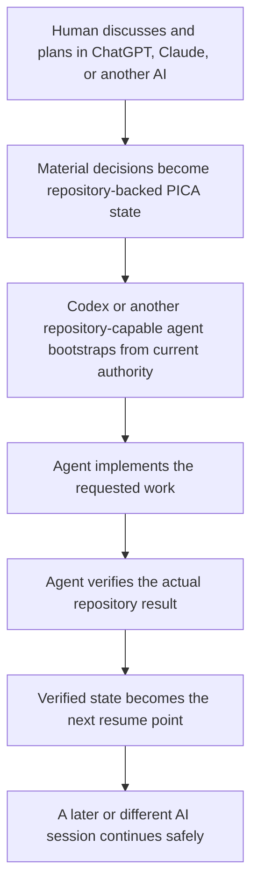

# U-GAS

## The conversation can be temporary; the project state is not.

U-GAS (Universal Agent System) is a small, Git-native operating model for AI-assisted work. It gives a project an explicit place for current instructions, state, progress, ideas, handoffs, and verification so a later or different repository-capable agent can continue from evidence instead of reconstructing everything from chat memory.

> **EXPERIMENTAL / VERY EARLY EXTERNAL TESTING** — Practical testing has primarily been with ChatGPT and Codex. There is **NO INDEPENDENT USER VALIDATION YET**. U-GAS is intended to be portable to other agents and tools, but those paths remain experimental and unvalidated.

## Why U-GAS?

Long-lived AI work often crosses chats, tools, repositories, and sessions. A useful decision can remain buried in a conversation; an execution agent may not see it; a later session may guess what happened; and the human becomes the memory, clipboard, Git/GitHub coordinator, and handoff mechanism.

U-GAS moves material project state into the repository that the work already depends on. It does not give an LLM perfect memory and it does not guarantee that an agent will follow instructions. It gives agents a shared, inspectable authority to reconcile against.

## A typical workflow



Different agents do not need to share hidden memory if they can read the same explicit project state, current repository rules, and verified Git history.

## Before and with U-GAS

| Without U-GAS | With U-GAS |
| --- | --- |
| Chat discussion → decision stays in conversation → execution agent lacks context or guesses → later session reconstructs state | Chat discussion → material state is persisted → execution agent reads current authority → change is implemented and verified |
| The owner repeats what happened and what comes next | The repository provides an explicit resume point |
| Handoffs depend on memory, copy/paste, and manual Git coordination | Handoffs can use current PICA, Git history, and an optional exact repository-backed payload |

U-GAS reduces coordination and reconstruction burden. It does not eliminate context loss, unsafe edits, stale state, or human decisions.

## Who is it for?

U-GAS is most relevant when you:

- work across fresh AI sessions or more than one AI tool/agent;
- separate conversational planning from repository execution;
- maintain a longer-lived project or multiple repositories;
- have experienced forgotten decisions, repeated work, stale assumptions, unsafe edits, or difficult resume/handoffs.

You may not need it for a small project completed in one tool and one session, with little continuity or handoff pain. The extra project structure should earn its cost.

## Quick Start

The current normal workflow requires:

- a GitHub repository you control, preferably a safe test or sandbox repository for a first run;
- an AI agent that can read and change that repository through a GitHub integration, connector, or local Git clone;
- permission for the agent to create or update the four PICA files and, for real project work, relevant project files.

You do not need a specific AI tool or connector. A plain chat session with no repository or file access cannot perform this workflow reliably.

If the agent cannot safely create files, manual creation from the portable PICA templates is an alternative; preserve substantive existing project rules and state.

Ask a repository-capable agent:

```text
I want to use U-GAS with my existing repository: <YOUR-REPOSITORY-URL>

Before changing anything, read the current U-GAS README and AGENTS.md directly from:
https://github.com/jaabster-dev/u-gas

Then read U-GAS AGENTS.md, inspect my repository's current branch, working tree,
AGENTS.md, CURRENT_STATE.md, PROGRESS.md, and IDEAS.md. Preserve existing work. Use
the portable PICA templates only for missing controls; preserve substantive existing
controls. Explain the smallest first action, make the four-file control shell complete
if it is missing, and stop when a real human
decision, authentication, secret, destructive action, device, or unclear product choice
is required.

Before claiming readiness, visibly report:

PICA SELF-CHECK
- AGENTS.md: PRESENT / CREATED / BLOCKED
- CURRENT_STATE.md: PRESENT / CREATED / BLOCKED
- PROGRESS.md: PRESENT / CREATED / BLOCKED
- IDEAS.md: PRESENT / CREATED / BLOCKED

Claim READY only when all four files are present, readable, and safely initialized, with
no unresolved authority or repository-purpose problem. Otherwise report:
BLOCKED — <specific reason>
```

The agent should own routine Git and file mechanics. You should only need to decide product scope, provide unavailable credentials or environment access, or approve a genuinely consequential boundary.

If the target `AGENTS.md` is missing, the agent may initialize it from the template. If it already contains substantive project rules, those rules must be preserved and only the smallest U-GAS bootstrap anchor should be integrated. After the PICA shell is installed, future repository-capable sessions can start from the target repository's `AGENTS.md`, which points back to the current U-GAS authority. Tell the agent in ordinary language what you want to accomplish; it should ask for correction only when product intent is genuinely unclear.

## How it works: PICA

Every U-GAS-managed project exposes four visible controls:

- `AGENTS.md` — how an agent must inspect, change, verify, and hand off work;
- `CURRENT_STATE.md` — the compact resume surface: active work, next action, waiting state, and boundaries;
- `PROGRESS.md` — chronological evidence of what actually happened;
- `IDEAS.md` — possibilities that are not accepted scope.

PICA is deliberately Markdown-first. It is not a database, installer, orchestration platform, or replacement for source control and CI. A repository-capable agent still reads current repository authority, preserves existing work, makes a bounded change, and verifies the result.

## Pause, resume, handoff, verify

To pause, record material state in `CURRENT_STATE.md` and useful evidence in `PROGRESS.md`. To resume, the agent reads current repository state first, reconciles it with PICA, verifies before acting, and follows the concrete `NEXT` action. Conversation memory is not a substitute for committed repository state.

Compact one-copy handoffs remain the default when the complete payload is short and reliable to transfer directly. Use the optional repository-backed [long-handoff transport](handoffs/README.md) proactively when a payload is long or materially structured, exact loss would be consequential, it already exists as durable structured material, or a previous clipboard/attachment transfer failed or became inaccessible. The transport validates `PENDING` payloads and removes them only after verified completion; it does not execute them.

For deeper procedures, see the [portable policies](ai/README.md), [self-check](scripts/check_u_gas.py), [handoff checker](scripts/check_handoff.py), and standard-library [tests](tests/).

## Safety and limitations

U-GAS does not:

- guarantee deterministic LLM behaviour or perfect memory;
- guarantee that a repository is safe merely because PICA files exist;
- choose product scope, grant credentials, approve destructive operations, or validate legal, account, security, device, or release decisions;
- replace source control, CI, security controls, or human judgement;
- claim reliability, adoption, benchmarks, industry-standard status, or independent validation.

If a run fails or feels confusing, record the repository and branch, expected action, actual result, exact observable error, and whether files changed. Never include passwords, tokens, recovery codes, private keys, or other secrets. Practical testing so far has primarily used ChatGPT and Codex; Claude, Cursor, Copilot, and other paths remain experimental where not independently validated.

## Repository contents

- [`AGENTS.md`](AGENTS.md) — public entry point and routing.
- [`CURRENT_STATE.md`](CURRENT_STATE.md), [`PROGRESS.md`](PROGRESS.md), [`IDEAS.md`](IDEAS.md) — the four-file project control surface.
- [`ai/`](ai/) — portable governance, GitHub workflow, continuity, structure, collaboration, and safe large-file guidance.
- [`skills/`](skills/) — progressive-disclosure resume, safe-patch, verification, external-research, and skill-review procedures.
- [`handoffs/README.md`](handoffs/README.md) — optional repository-backed long-handoff transport.
- [`templates/pica/`](templates/pica/) — truthful templates for missing controls.
- [`examples/first-project/`](examples/first-project/) — minimal PICA example.
- [`scripts/check_u_gas.py`](scripts/check_u_gas.py) — optional read-only U-GAS/project self-check.
- [`scripts/check_handoff.py`](scripts/check_handoff.py) — read-only pending-handoff contract checker.
- [`tests/`](tests/) and [`.github/workflows/u-gas-self-tests.yml`](.github/workflows/u-gas-self-tests.yml) — standard-library contracts and CI self-tests.

## Status and license

U-GAS is experimental and intended for early external testing. It is released under the [MIT License](LICENSE). For the first independent test, give feedback by commenting on [Issue #1](https://github.com/jaabster-dev/u-gas/issues/1): where you got stuck, what was unclear, what the agent failed to do, unexpected friction, and whether the workflow resumed or worked as described. Do not post secrets or sensitive private-repository content.

The distribution self-check verifies U-GAS's own files and routes. The optional `--project <path>` check verifies only readable, non-empty PICA files, the canonical upstream anchor in `AGENTS.md`, and the minimum `CURRENT_STATE.md` resume contract. These checks do not prove product correctness, current-state truth, runtime/model compliance, GitHub access, branch correctness, repository safety, or independent validation.
